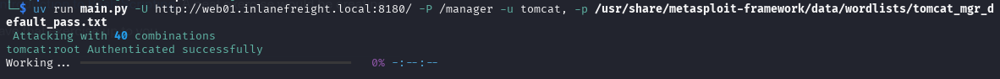

*This work has been sponsored by [Sythe Labs](https://sythelabs.com)*.

# Tomcat
🐱 Some tomcat scripts

## Usage
```

 Usage: main.py [OPTIONS]

╭─ Options ─────────────────────────────────────────────────────────╮
│ *  --url                 -U      TEXT  The Tomcat URL to brute    │
│                                        force.                     │
│                                        [default: None]            │
│                                        [required]                 │
│ *  --path                -P      TEXT  The manager or             │
│                                        host-manager URI           │
│                                        [default: None]            │
│                                        [required]                 │
│    --usernames           -u      TEXT  The file or                │
│                                        comma-separated username   │
│                                        list.                      │
│                                        [default: tomcat,admin]    │
│    --passwords           -p      TEXT  The file or                │
│                                        comma-separated password   │
│                                        list.                      │
│                                        [default: tomcat,admin]    │
│    --verbose             -v            Show passed and failed     │
│                                        inputs.                    │
│    --debug               -d            Show the HTTP request      │
│                                        being made                 │
│    --install-completion                Install completion for the │
│                                        current shell.             │
│    --show-completion                   Show completion for the    │
│                                        current shell, to copy it  │
│                                        or customize the           │
│                                        installation.              │
│    --help                              Show this message and      │
│                                        exit.                      │
╰───────────────────────────────────────────────────────────────────╯
```

## In Action



## Examples
If you only have one username or password, make sure you end it with `,`.
```bash
uv run main.py -U <url>:8180/ -P /manager -u tomcat, -p /path/to/pws.txt
```

```bash
uv run main.py -U <url>:8180/ -P /manager -u /path/to/wordlist -p /path/to/pws
```
